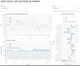

#  Explore time series datasets 

**`xplorts`** ("explore-ts") is a collection of Python tools to make standalone HTML documents containing interactive charts.  It is particularly aimed at showing time series data (hence the "ts") with annual, quarterly or monthly periodicity, such as that published by national statistical institutes by way of national accounts, productivity, or labour markets series. 

Once created, the HTML documents can be used with any web browser.  They do not need an
active internet connection.

## Installation
```
pip install xplorts
```

## Demo

To see a sample data explorer, try [Explore UK output per hour worked](docs/xplor_lprod%20oph%20annual%20by%20section.html).

> Source: Office for National Statistics licensed under the Open Government Licence v.3.0

The labour productivity explorer demonstrates these features:
- Grouped multi-line charts show a set of related lines for one split level at a time, like time series for productivity, gross value added, and hours worked for a particular industry.
- Grouped components charts show a set of stacked bars in combination with a totals line, for one split level at a time, like cumulative growth time series for gross value added, hours worked (sign reversed), and productivity for a particular industry.
- Drop-down list and slider widgets provide interactive selection of the split level to show.
- Hover tool displays data values under the cursor.
- Charts are provided with controls for box zoom, wheel zoom, pan, and save to file.
- Time periods can be represented on a chart axis as nested categories like (year, quarter).
- Categorical values represented on a chart axis can represent time periods, levels of a split factor, or whatever.


### Make explorer for ONS labour productivity data

1. Download [Output per hour worked, UK](https://www.ons.gov.uk/economy/economicoutputandproductivity/productivitymeasures/datasets/outputperhourworkeduk) from the ONS web site.

1. Open a `Terminal` window (Macintosh) or `Command prompt` window (Windows).

1. Extract productivity, gross value added and labour data using the utility script `ukons_lprod_to_csv.py`.  The extracted time series will go into a file `outputperhourworked.csv` in the folder next to the original `Excel` dataset.

   In the command shell or terminal window:
   ```
   python xplorts/utils/ukons_lprod_to_csv.py outputperhourworked.xlsx --quarterly --section
   ```
   Note: For older versions of Pandas you will have to open the Excel file, save it as `.xls`, and use that rather than the original `.xlsx` format.
1. Run the script `xplor_lprod` to create a stand-alone `HTML` labour productivity explorer in the file `outputperhourworked.html`.

   In the command shell or terminal window:
   ```
   python xplorts/xplor_lprod.py outputperhourworked.csv -d date -b industry -p lprod -g gva -l labour
   ```
1. Use the explorer in any web browser.


## Documentation

### Using `xplorts` in Python


### Using `xplorts` on the command line
- Install (once, possibly within a particular virtual environment)
- Open a `Terminal` window (Macintosh) or `Command prompt` window (Windows)
- Activate virtual environment, if relevant
    On Windows:
    ```my_env```
    On Mac:
    ```conda activate my_env```
- Run an `xplorts` script

#### Getting help about command line options

Pass the option `-h` to any `xplorts` script to get help.  For example:
```
python xplor_lprod.py -h
```

> <pre>
> usage: xplor_lprod.py [-h] [-b BY] [-d DATE] [-p LPROD] [-v GVA] [-l LABOUR]
>                       [-g ARGS] [-t SAVE] [-s]
>                       datafile
> 
> Create interactive visualiser for labour productivity levels with a split
> factor
> 
> positional arguments:
>   datafile              File (CSV) with data series and split factor
> 
> optional arguments:
>   -h, --help            Show this help message and exit
>   -b BY, --by BY        Factor variable for splits
>   -d DATE, --date DATE  Date variable
>   -p LPROD, --lprod LPROD
>                         Productivity variable
>   -v GVA, --gva GVA     Gross value added (GVA) variable
>   -l LABOUR, --labour LABOUR
>                         Labour variable (e.g. jobs or hours worked)
>   -g ARGS, --args ARGS  Keyword arguments.  YAML mapping of mappings.  The
>                         keys 'lines', 'growth_series' and 'growth_snapshot' 
>                         can provide keyword arguments to pass to
>                         `prod_ts_lines`, `prod_ts_growth` and 
>                         `prod_growth_snapshot`, respectively.
>   -t SAVE, --save SAVE  Interactive .html to save, if different from the
>                         datafile base
>   -s, --show            Show interactive .html
</pre>


---
### Developer note
This document uses
[Github-flavored Markdown](https://guides.github.com/features/mastering-markdown/)
.
