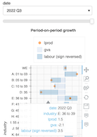

<!-- This document uses
[Github-flavored Markdown](https://guides.github.com/features/mastering-markdown/) -->

# Explore time series datasets

**`xplorts`** ("explore-tee-ess") is a collection of Python tools to make standalone HTML documents containing interactive charts.  It is particularly aimed at showing time series data (hence the "ts") with annual, quarterly or monthly periodicity, such as that published by national statistical institutes by way of national accounts, productivity, or labour markets series.

Once created, the HTML documents can be used with any web browser.  They do not need an
active internet connection.

<details>
   <summary>

## Installation
</summary>

```
pip install xplorts
```

For `xplorts.utils.ukons_lprod_to_csv` etc., you also need `openpyxl`:
```
pip install openpyxl
```
</details>
<details>
<summary>

## Demo
</summary>

To see an interactive sample data explorer, try [Explore UK output per hour worked](docs/xplor_lprod%20oph%20annual%20by%20section.html).

> Source: Office for National Statistics licensed under the Open Government Licence v.3.0

### Steps to make explorer for ONS labour productivity data

1. Download [Output per hour worked, UK](https://www.ons.gov.uk/economy/economicoutputandproductivity/productivitymeasures/datasets/outputperhourworkeduk) from the ONS web site.

1. Open a `Terminal` window (Macintosh) or `Command prompt` window (Windows).

1. Extract productivity, gross value added and labour data using the utility script `ukons_lprod_to_csv.py`.  The extracted time series will go into a file `outputperhourworked.csv` in the folder next to the original `Excel` dataset.

   In the command shell or terminal window:
   ```
   python xplorts/utils/ukons_lprod_to_csv.py outputperhourworked.xlsx --quarterly --section
   ```
   Note: For older versions of Pandas you will have to open the Excel file, save it as `.xls`, and use that rather than the original `.xlsx` format.
1. Run the module `dblprod` to create a stand-alone `HTML` labour productivity dashboard in the file `outputperhourworked.html`.

   In the command shell or terminal window:
   ```
   python -m xplorts.dblprod outputperhourworked.csv -d date -b industry -p lprod -g gva -l labour
   ```
1. Use the explorer in any web browser.
</details>


<details>
<summary>

## Features
</summary>

The labour productivity explorer demonstrates these features:
- A grouped multi-line chart shows a set of related lines for one split level at a time, like time series for productivity, gross value added, and hours worked for a particular industry.<br> 
- A time series components chart shows a set of stacked bars in combination with a totals line, for one split level at a time, like cumulative growth time series for gross value added, hours worked (sign reversed), and productivity for a particular industry.<br> 
- A snapshot growth components chart shows a set of stacked bars in combination with markers showing total growth, as a function of a categorical factor, like growth for gross value added and hours worked (sign reversed) by industry, along with growth in productivity, for a selectable time period.<br> 
- A heatmap chart shows data values as a function of a categorical split variable across time.
- Drop-down list and slider widgets provide interactive selection of a categorical split level or snapshot time period to show. Static screenshots are shown here, but check out the interactive sample data explorer at the link above.<br>  
- Hover tool displays data values at the cursor location.
- Chart tools include box zoom, wheel zoom, pan, and save to file.
- Time periods can be represented on a chart axis as nested categories like (year, quarter).
- A categorical chart axis can represent time periods or levels of a split factor.
</details>

<details>
<summary>

## Using `xplorts` in Python
</summary>

### Import
Import the package into your code:
```
import xplorts
```

### Package documentation
To show the docstring for the package:
```
xplorts?
```

To show the docstring for a particular module, like `slideselect`:
```
xplorts.slideselect?
```

### Modules

Module | Description
--- | ---
base | Miscellaneous helper functions and classes.
diff | Multi-tab revisions display for two vintages of a dataset.
dutils | Miscellaneous data manipulation helpers.
dashboard | Multi-tab dashboard showing levels, growth components, and growth heatmaps.
dblprod | Modify a Bokeh Figure by adding charts to show labour productivity levels or growth components.
ghostbokeh | Define an abstract base class to a build pseudo-subclass of a Bokeh class.
growthcomps | Growth of time series and their contribution to growth of derived series.
heatmap | Functions to create a heatmap of data values as a function of horizontal and vertical categorical variables.
lines | Line charts to show several time series with a split factor.
scatter | Scatter charts to show one or more categorical series with a split factor.
slideselect | Class combining select and slider widgets, with support for javascript linking to other objects.
snapcomp | Snapshot growth components chart, with a categorical vertical axis showing levels of a split factor, horizontal stacked bars showing growth components, and markers showing overall growth for each stack of bars.
stacks | Horizontal or vertical stacked bar chart showing several data series with a split factor.
tscomp | Growth components chart, with a categorical vertical axis showing levels of a split factor, horizontal  stacked bars showing growth components, and a line showing overall growth.
</details>

<details>
   <summary>

## Using `xplorts` on the command line
   </summary>

- Install (once, possibly within a particular virtual environment)
- Open a `Terminal` window (Macintosh) or `Command prompt` window (Windows)
- Activate virtual environment, if relevant

    On Windows:

    ```activate my_env```

    On Mac:

    ```conda activate my_env```
- Execute an `xplorts` module entry point
  ```
  xp-dashboard ...
  ```
- Or tell `python` explicitly to run an `xplorts` module

  ```
  python -m xplorts.dashboard ...
  ```

### Getting help about command line options

Pass the option `-h` to any `xplorts` script to get help.  For example:
  ```
  xp-dashboard -h
  ```

Or
  ```
  python -m xplorts.dblprod -h
  ```

> <pre>
> usage: dblprod.py [-h] [-b BY] [-d DATE] [-p LPROD] [-v GVA] [-l LABOUR]
>                       [-g ARGS] [-t SAVE] [-s]
>                       datafile
>
> Create interactive visualiser for labour productivity levels with a split
> factor
>
> positional arguments:
>   datafile              File (CSV) with data series and split factor
>
> optional arguments:
>   -h, --help            Show this help message and exit
>   -b BY, --by BY        Factor variable for splits
>   -d DATE, --date DATE  Date variable
>   -p LPROD, --lprod LPROD
>                         Productivity variable
>   -v GVA, --gva GVA     Gross value added (GVA) variable
>   -l LABOUR, --labour LABOUR
>                         Labour variable (e.g. jobs or hours worked)
>   -g ARGS, --args ARGS  Keyword arguments.  YAML mapping of mappings.  The
>                         keys 'lines', 'growth_series' and 'growth_snapshot'
>                         can provide keyword arguments to pass to
>                         `prod_ts_lines`, `prod_ts_growth` and
>                         `prod_growth_snapshot`, respectively.
>   -t SAVE, --save SAVE  Interactive .html to save, if different from the
>                         datafile base
>   -s, --show            Show interactive .html
</pre>

### `xplorts` scripts

Script | Entry point | Description
--- | --- | ---
dashboard | xp-dashboard | Multi-tab dashboard showing levels, growth components, and growth heatmaps.
dblprod | xp-dblprod | Create a labour productivity dashboard, with three charts including: <ul><li>a lines chart showing levels of labour productivity, gross value added, and labour,</li> <li>a time series growth components chart showing cumulative growth in labour productivity, gross value added, and labour, and</li> <li>a snapshot growth components chart showing period-on-period growth in labour productivity, gross value added, and labour.</li>
diff | xp-diff Multi-tab revisions display for two vintages of a dataset, showing revisions in levels, growths, and cumulative growth.
heatmap | xp-heatmap | Create a heatmap of values as a function of two categorical variables.
lines | xp-lines | Create a line chart showing several time series with a split factor.  Widgets select one split factor category at a time.
scatter | xp-scatter | Create scatter chart showing one or more time series with a split factor.  Widgets select one split factor category at a time.
snapcomp | xp-snapcomp | Create a snapshot growth components chart, with a categorical vertical axis showing levels of a split factor, horizontal stacked bars showing growth components, and a line showing overall growth.  A widget selects one time period at a time.
stacks | xp-stacks | Create stacked bar chart showing several data series with a split factor.  Widgets select one split factor at a time (or one time period at a time if the split factor is plotted as a chart axis).
tscomp | xp-tscomp | Create a time series growth components chart, with time periods along the horizontal axis, vertical stacked bars showing growth components, and a line showing overall growth.  Widgets select one split factor category at a time.
utils.ukons_lcli_to_csv |  | Extract data from ONS [labour costs and labour income dataset](https://www.ons.gov.uk/economy/economicoutputandproductivity/productivitymeasures/datasets/labourcostsandlabourshare), in a format suitable for use with `xplorts` charts.
utils.ukons_lprod_to_csv |  | Extract data from ONS labour productivity datasets such as [Output per hour worked, UK](https://www.ons.gov.uk/economy/economicoutputandproductivity/productivitymeasures/datasets/outputperhourworkeduk), in a format suitable for use with `xplorts` charts.
utils.ukons_psp_to_csv |  | Extract data from ONS dataset [Public service productivity estimates: total public service](https://www.ons.gov.uk/economy/economicoutputandproductivity/publicservicesproductivity/datasets/publicserviceproductivityestimatestotalpublicservice), in a format suitable for use with `xplorts` charts.
</details>
